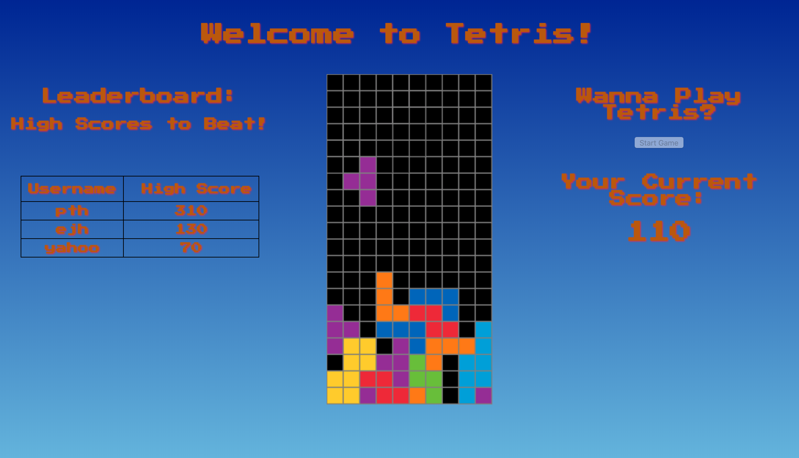
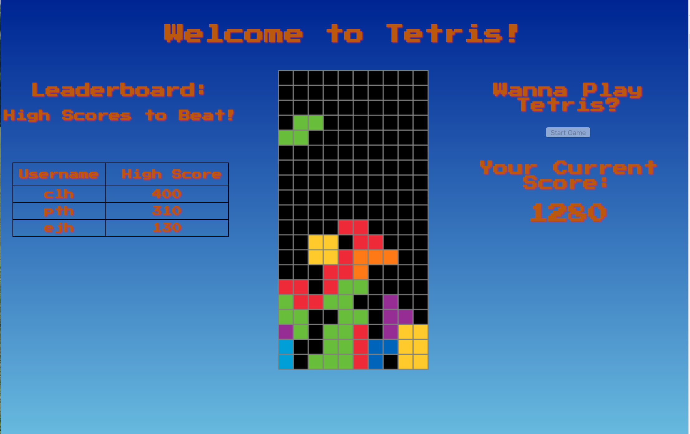
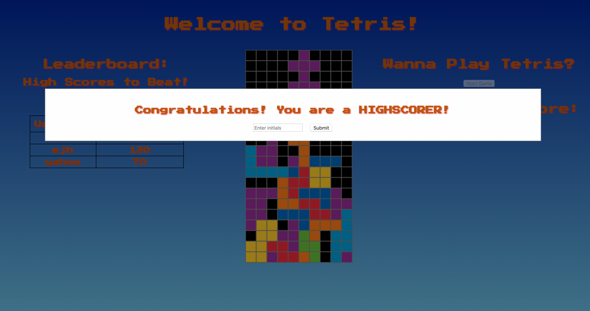
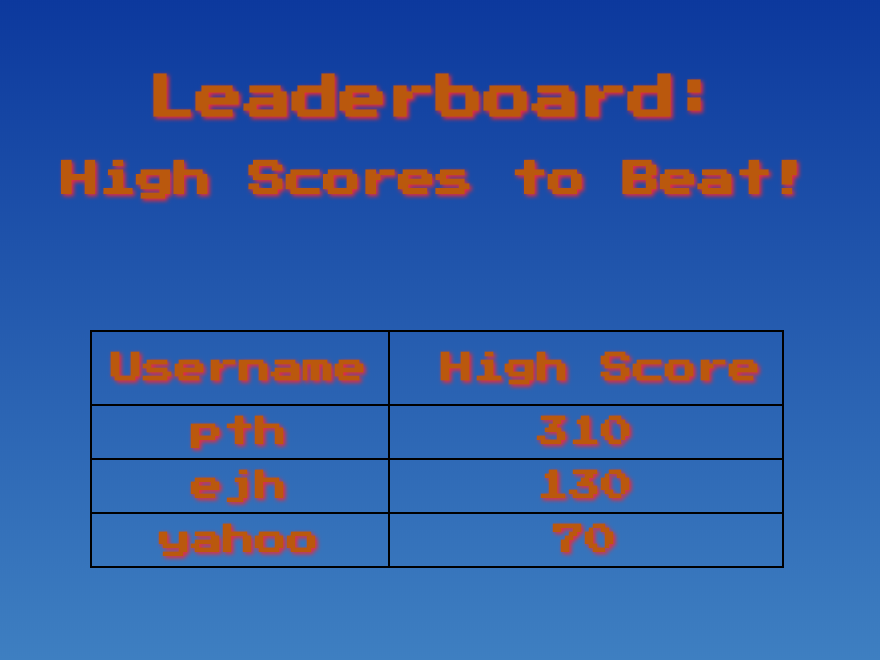
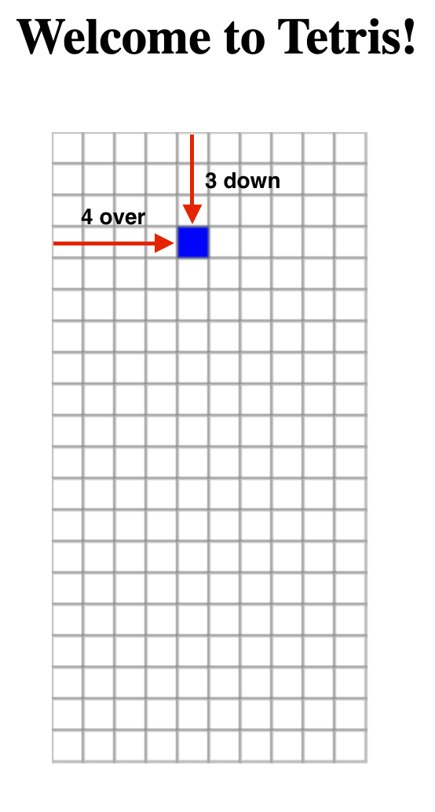
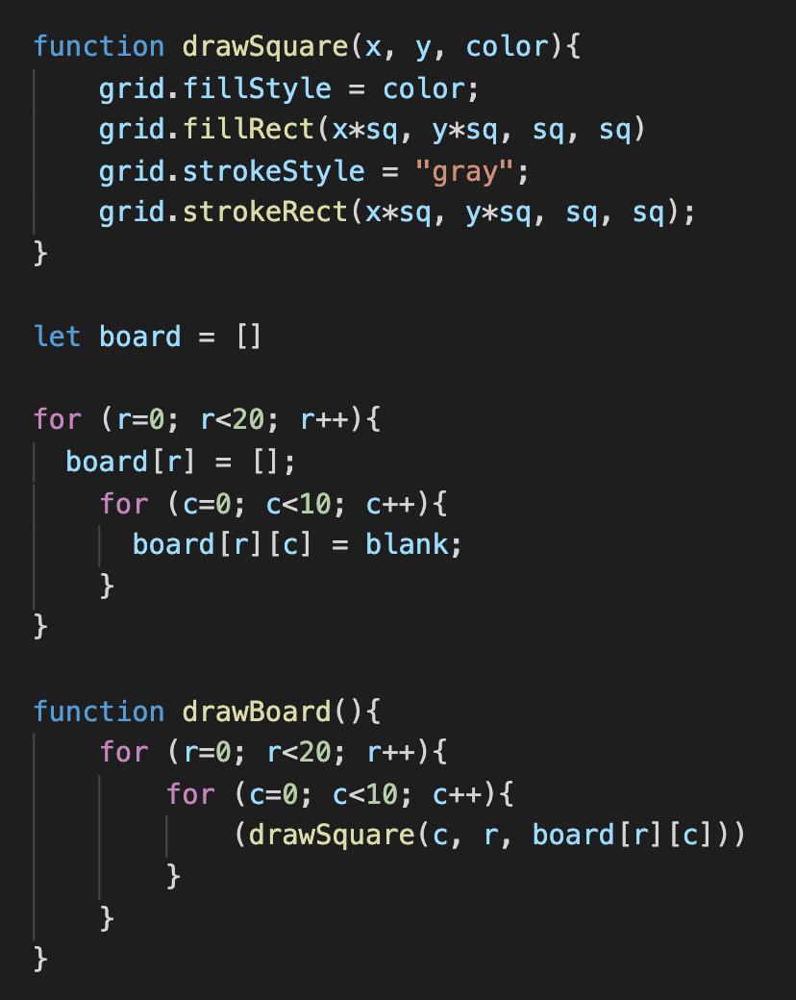
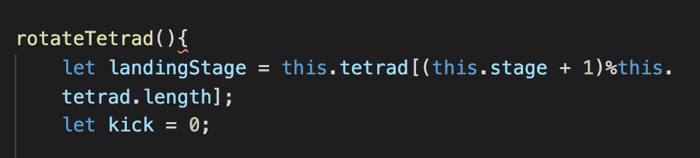
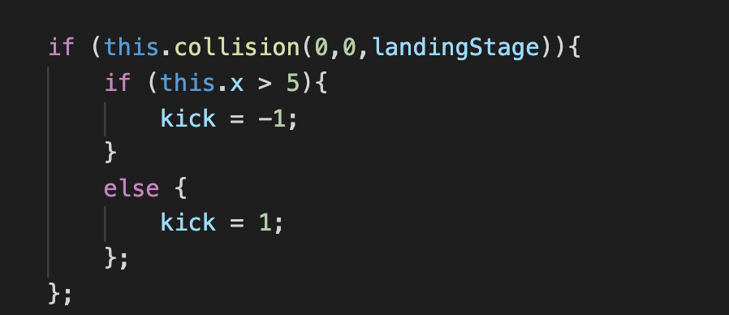
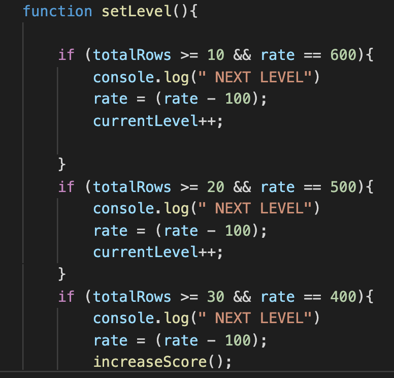

# Flatiron Tetris
**Tetris by [Clarion Heard](https://github.com/clheard54), [Jonny Riecke](https://github.com/Jricecake), and [Joe Avila](https://github.com/javila35)**

Overview and inspiration:

Head over to <a href="https://mod-3-tetris.herokuapp.com/">T3TRIS</a> to play the epic game online!

<br><br>
<b>Game Preview</b>
<br /> 

<br>

## Installing Locally

 - If you'd like to clone down this project repository to your local computer, you can do so by forking it, then hitting the "Clone or download" button in your own fork. Copy the SSH link, and open up your computer's Terminal. Inside, type "git clone <the link you've just copied>". 
 ```
   git clone <example: git@github.com:.../Mod-3-Tetris-Frontend.git></example:>
  ```
 - You'll also need to fork and clone down the <a href="https://github.com/clheard54/Tetris-Backend-Api">backend</a> repo for this project. You can find the link here: https://github.com/clheard54/Tetris-Backend-Api. Follow the same steps as above.

 - Back in your terminal, type "bundle install".
  ```
   bundle install
  ```
 - Then, from the root directory, run "rake db:create" and "rake:db:migrate" to create the database locally.
  ```
   rake db:create && db:migrate
  ```
 - Lastly, run "rake db:seed". Now you're ready to go!
  ```
   rake db:seed
  ```


To open the app, you'll have to start up a local server. In your terminal, navigate to the backend api directory and then type "rails s".
 ```
 rails s
 ```
 If you'd like to see your backend database, you can head to "http://localhost:3000/api/v1/leaders" on your favorite browser.

Lastly, navigate to the frontend directory, and (again in your terminal) type "open index.html". You're good to go!

## How to Play Tetris

When you press "Start Game", pieces (also known as "tetrads" or "tetrominos") will start falling from the sky (ie, the top of the board). Your job is to control those pieces as they fall, and to stack them so that they fill entire rows. When a row is entirely filled, it will clear, and your points will increase. But hurry -- as more time passes, the pieces will begin to fall faster and faster! And as soon as the pieces pile up to the top of the screen, GAME OVER.

Key Commands:
→ (Arrow Right) : moves the piece to the right.</br>
← (Arrow Left) : moves the piece to the left.</br>
↓ (Arrow Down) : speeds up the piece's movement down.</br>
↑ (Arrow Up) : rotates the piece 90 degrees.</br>
Spacebar : pauses the game. (Don't cheat!)</br>

Scoring:
 - For a single filled row : 40 pts
 - Two rows filled (and cleared) at once : 100 pts
 - Three rows filled at once : 300 pts
 - Four row cleared at once : 1200 pts

   &emsp; (Note: These scores all double once you reach Level 3.)

Levels:
For every ten rows cleared, you move to the next level.

## Preview

<b>Welcome to Tetris:</b>
<br /> <br>

<br><br>
<b>New Highscore!:</b>
<br />

<br><br>
<b>Leaderboard:</b>
<br />

<br><br>

## Highlights

Some neat tricks:
Drawing the Tetris board proved to be more of a challenge than we initially anticipated. Ultimately, we knew we were probably looking at an array (the entire board) of arrays (20 rows) of arrays (to represenet the 10 columns). How to draw each individual grid box? Using the HTML canvas element, we took advantage of the built-in grid methods, such as fillRect(). The big breakthrough, those, was deciding to define a constant "sq" to represent the width/height of a single square. Each "sq" represented one unit. This would make it extremely easy to think of the board as a cartesian plane: In order to locate a piece on the board, we could simply count the number of squares over and down (from the top left corner).



No longer was there the need to measure position by pixels (yikes). Instead, behold: 



Another fun piece of code to write was the function for rotating a piece. There were several cases to deal with: a piece hitting the edge of the board and needing to be nudged over to compensate, a rotation causing a collision with another piece, etc. To deal with this, we stored each piece as an array of its four rotational positions. Before rotating, we previewed the piece's next position.



We checked to see whether the rotation would cause a wall collision -- and if so,which side of the board it might collide with (ten columns meant that if the x-position was > 5, the piece was more than halfway across the board). If it hit the right wall, we knew an adjustment left would be necessary; its position would need to be (-1) in the x-direction. On the left, a "kick" of one unit to the right was necessary.



Lastly, we re-drew the piece, incorporating the information from above where necessary. A collision with another piece would prevent a rotation; otherwise, the piece assumed its next rotational position.


Scoring System:

The scoring system is a simple checker that looks at the player's current total of rows cleared and adjusts difficulty accordingly. Classic Tetris increases levels every 10 rows cleared, so to mimic this, we implemented a check on variable totalRows after a piece gets locked. If over 10, then the fall rate is increased, and at certain level increments, point values are increased.




## Credits

Thank you to...

... <a href="https://www.codeexplained.org/2018/08/create-tetris-game-using-javascript.html">CodeExplained</a> for the walkthrough of how to "draw" pieces on the screen.

... <a href="https://www.w3schools.com/html/html5_canvas.asp">W3Schools</a> for its guide to using canvas elements in HTML.

... <a href="https://www.thatsoftwaredude.com/content/8519/coding-tetris-in-javascript-part-1">The Software Dude</a>, who offered inspiration for conceiving of the tetris board as a cartesian coordinate plan.


## Contributing

Contributions are most welcome. This is very much a beginner project, and constructive criticism is appreciated. Feel free to open a pull request or branch from this project.

## License

This project is licensed under the [GNU GPL](https://www.gnu.org/licenses/gpl-3.0.en.html)

Enjoy.